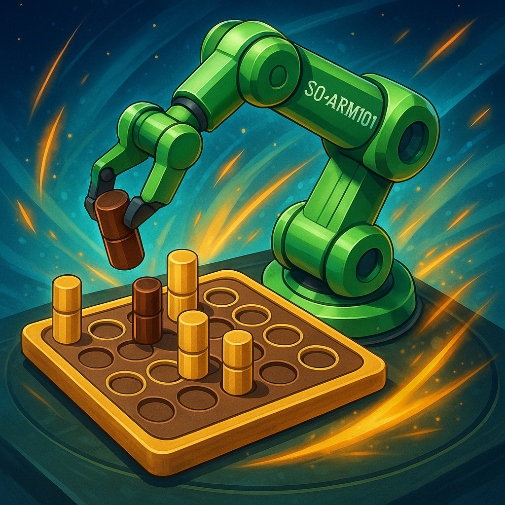
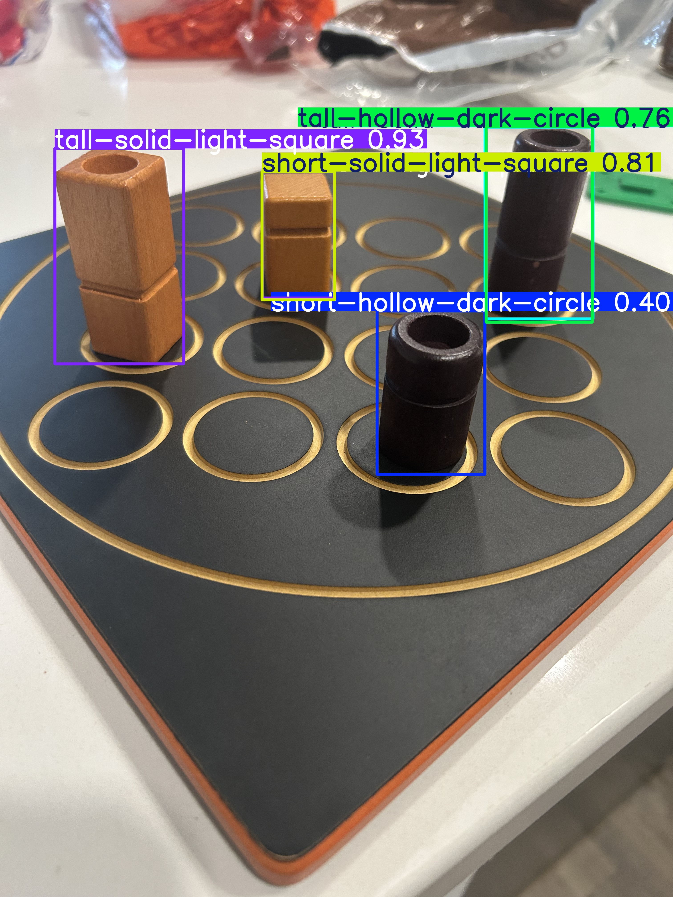

# Quarto Bot

  

Inspired by a post on X about the LeRobot Hackathon, where a team trained the [SO-Arm101](https://github.com/TheRobotStudio/SO-ARM100?tab=readme-ov-file) to pick up and place chess pieces, I decided to take on a similar challenge. Rather than simply replicating their work, I wanted to push the concept further: my goal was to train the SO-Arm101 not only to pick-n-place game pieces, but also to understand and play the game itself. Specifically, I set out to teach the SO-Arm101 to play [Quarto](https://en.wikipedia.org/wiki/Quarto_(board_game)), transforming it from a simple robotic arm into an interactive game-playing bot.

## Project Overview
The project involves several key components:
- **Robot Control**: Training the SO-Arm101 to pick up and place pieces on the board.
- **Computer Vision**: Enabling the bot to recognize pieces and their positions on the board
- **ML Strategy**: Developing a Reinforcement Learning (RL) agent that can make strategic decisions based on the current game state.

## Robot Control 

---
## Computer Vision

### Object Detection
To identify the game pieces, I decided to fine-tune a YOLOv11 model using the [Ultralytics YOLO](https://github.com/ultralytics/ultralytics?tab=readme-ov-file) library. The training process involved the following steps:

1. **Collect and Annotate Images**: I captured a diverse set of images of the Quarto pieces in various positions and lighting conditions. I then annotated each image with bounding boxes for every piece using [Roboflow](https://roboflow.com/). But you can also use [LabelImg](https://github.com/tzutalin/labelImg).

2. **Prepare Dataset and Configuration**: I exported the annotated dataset in YOLO format and created a YAML configuration file specifying the dataset paths, class names (labels), and model parameters.

3. **Train the Model**: I used the [Ultralytics YOLO](https://github.com/ultralytics/ultralytics?tab=readme-ov-file) library to train the model, adjusting hyperparameters such as image size, number of epochs, and batch size to optimize performance.

4. **Evaluate and Iterate**: After training, I evaluated the model’s accuracy on a validation set and refined the dataset or tweaked parameters as needed to improve detection results. (Still working on this part)

| Before                | After                   |
|-----------------------|-------------------------|
|     |  |

### Board Position Detection

---