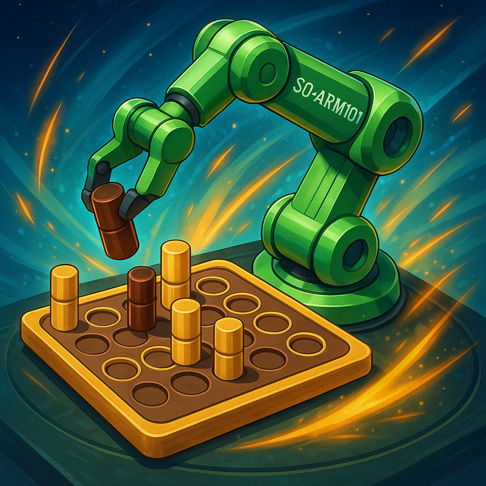
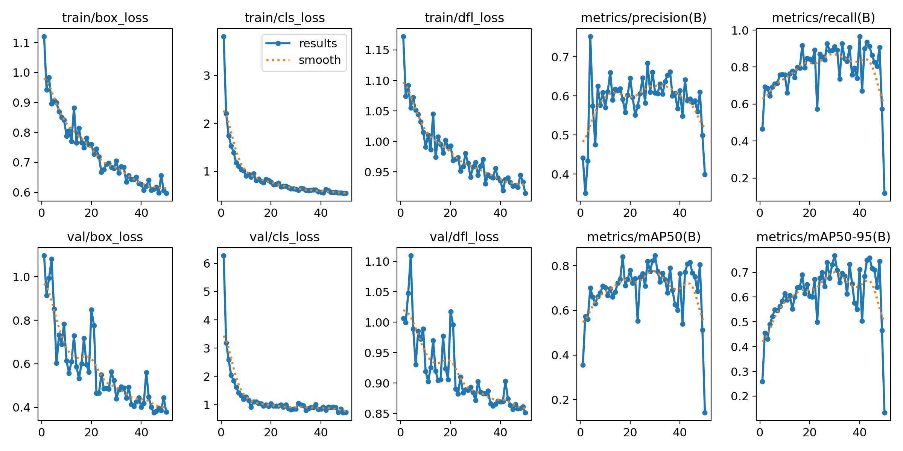
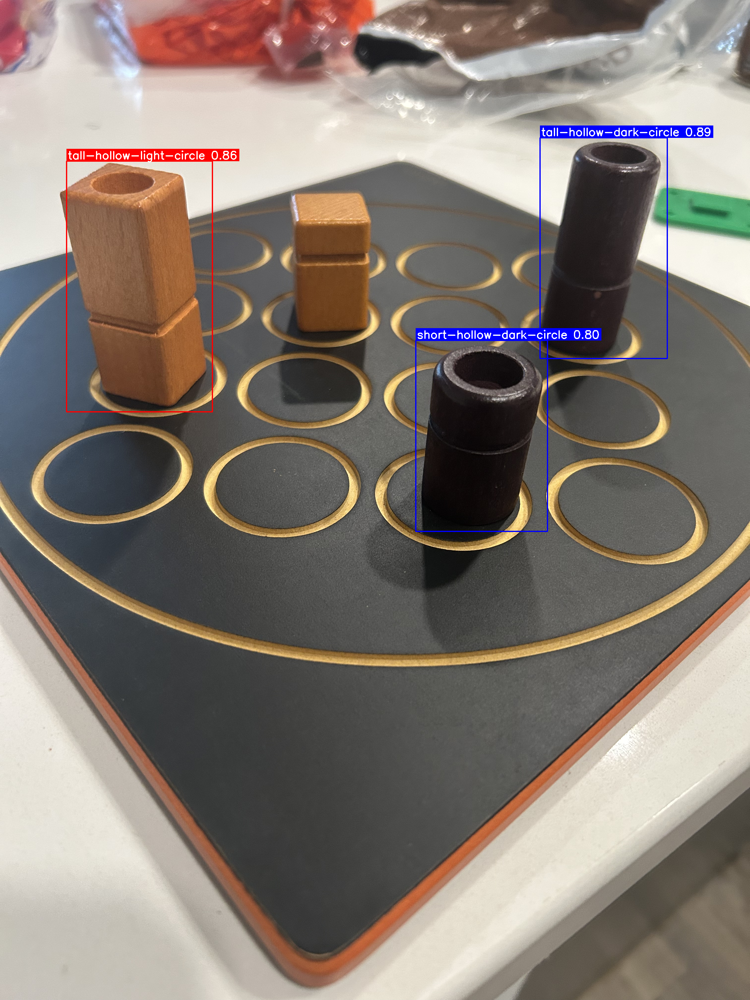

# Quarto Bot

<p align="center">
  
</p>

Inspired by a post on X from the LeRobot Hackathon, where a team trained the [SO-Arm101](https://github.com/TheRobotStudio/SO-ARM100?tab=readme-ov-file) to pick up and place chess pieces, I decided to take on a similar challenge. Rather than simply replicating their work, I wanted to push the concept further: my goal was to train the SO-Arm101 not only to pick-n-place game pieces, but also to understand and play the game itself. Specifically, I set out to teach the SO-Arm101 to play [Quarto](https://en.wikipedia.org/wiki/Quarto_(board_game)), transforming it from a simple robotic arm into an interactive game-playing bot.

## Project Overview
The project is organized into modular packages in the `packages/` directory:
- **quarto-engine** (`packages/quarto-engine`): Core Python implementation of Quarto rules and state.
- **quarto-vision** (`packages/quarto-vision`): Computer vision pipeline using YOLOv11 for piece detection.
- **quarto-sim** (`packages/quarto-sim`): MuJoCo simulation and PufferLib RL training environment.
- **quarto-driver** (`packages/quarto-driver`): Hardware interface for the SO-Arm101 and camera.
- **quarto-brain** (`packages/quarto-brain`): Strategy agents for gameplay decisions.

## Development Setup (uv)
The repository uses [uv](https://github.com/astral-sh/uv) workspaces for dependency management.

```bash
# 1. Install uv (once per machine)
curl -LsSf https://astral.sh/uv/install.sh | sh

# 2. Sync the workspace (installs all package dependencies)
uv sync

# 3. Run scripts through the synced environment
uv run python packages/quarto-sim/quarto_sim/rl/train_pick_puffer.py
```

## RL Training (PufferLib)
- **Config-driven tasks**: `packages/quarto-sim/config/puffer_pick.yaml` defines MuJoCo XML path, randomization bounds, and PPO parameters.
- **Training loop**: Launch PPO training with:
  ```bash
  uv run python packages/quarto-sim/quarto_sim/rl/train_pick_puffer.py --total-timesteps 1000000
  ```
- **Output**: Checkpoints land in `models/puffer_pick/` and metrics stream to `data/puffer_pick/metrics.jsonl`.

## Computer Vision
To identify the game pieces, I fine-tuned a YOLOv11 model.

```bash
# Run detection on an image
uv run python packages/quarto-vision/quarto_vision/piece_detection.py image path/to/image.jpg

# Run detection on camera feed
uv run python packages/quarto-vision/quarto_vision/piece_detection.py live
```

### Training Log (07-10-2025)
- mAP50: 72.6%
- Issues: Low recall on hollow pieces. Need more training data.


| Before | After |
|--------|-------|
|  |  |
